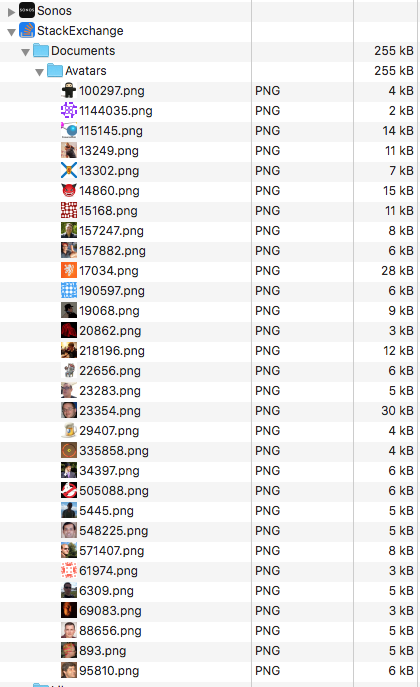

StackExchange API Sample
===========

## Overview
Calls StackExchange API [user endpoint](https://api.stackexchange.com/2.2/users?site=stackoverflow) to retrieve Stack Overflow user information.

## Features

* Downloads user's avatar once and saves it locally (e.g., app's document directory)
  * App will cache image to speed up retrieval and reduce file I/O

* Supports pull-down-refresh (UsersTableViewController)

* Allow user to force download avatars

## CocoaPods referenced

* [AFNetworking](https://github.com/AFNetworking/AFNetworking) (3.0)
  * make web services calls - has nice API
  * could easily use NSURLSession (improvement over NSURLConnection)
* [OCMapper](https://github.com/aryaxt/OCMapper) (2.0)
  * map API JSON response to app models
* [SDWebImage](https://github.com/rs/SDWebImage) (4.0)
  * asynchronously download avatar images
  * popular, maintained and well known pod

## App Screenshots
Shows avatars stored in app's document directory.

### Users

### User Details

## Settings

